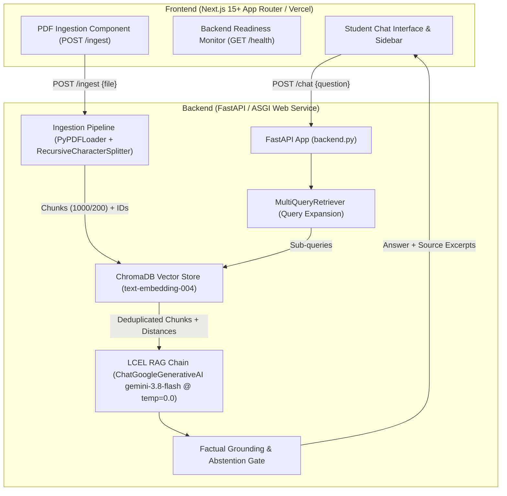

# Autonomous MirAI Student Policy Advisor

> **Product Tagline**: *Your University Policies. Clear Answers. Verified Sources.*  
> **Institution**: Mirai School of Technology (MSOT) — Student Affairs & Academic Services  
> **Target Document**: `Mirai_SoT_Policy_Handbook_2026.pdf`

---

## 1. Project Overview

**Autonomous MirAI Student Policy Advisor** is a production-quality, full-stack AI application designed to provide students with factual, verified, and citation-backed guidance on institutional university regulations. 

The system covers critical campus policies, including:
- **Academic Evaluation & CGPA Calculation** (grading system, composite marks)
- **Attendance Policy** (minimum 75% thresholds, condonation rules, attendance marks)
- **Examination & Malpractice Policy** (misconduct tiers, disciplinary hearings)
- **Medical Leave Procedures** (leave condonation, coordinator emails, 7-day deadlines)
- **Student Societies & Clubs** (charter approvals, 40% batch petition rules)
- **Code of Conduct** (anti-ragging, prohibited substances, Disciplinary Committee penalties)

### Core Architectural Principle: Zero Hallucination
The advisor operates under strict **evidence-based factual guardrails**:
- The AI **never invents** policies, monetary fines, deadlines, attendance marks, or staff contacts.
- Every answer is exclusively grounded in retrieved passages from the official handbook.
- When evidence is absent, ambiguous, or out-of-scope, the advisor **politely abstains** rather than speculating.

---

## 2. Architecture & Data Flow



---

## 3. Technology Stack

| Layer | Technologies | Configuration / Rationale |
| :--- | :--- | :--- |
| **Frontend** | Next.js 15+ (App Router), TypeScript, Tailwind CSS, Lucide React | Clean academic UI, strict types, responsive drawer, accessible design. |
| **Backend** | Python 3.14+, FastAPI, Uvicorn, Pydantic v2, Pydantic Settings | Modular ASGI architecture, non-blocking asynchronous execution via `asyncio.to_thread`. |
| **Document Processing** | `PyPDFLoader`, `RecursiveCharacterTextSplitter` | `chunk_size = 1000`, `chunk_overlap = 200`, deterministic chunk IDs (`doc_p001_c001`). |
| **Embeddings** | `GoogleGenerativeAIEmbeddings` | `text-embedding-004` (768 dimensions). |
| **Vector Database** | `ChromaDB` (via `langchain-chroma`) | Persistent local disk client with duplicate chunk detection and safe versioning. |
| **Retrieval** | `MultiQueryRetriever` (LangChain) | Real LLM query expansion generating 3 alternate student/formal perspectives. |
| **LLM Generation** | `ChatGoogleGenerativeAI` | `gemini-3.8-flash`, strictly set at `temperature = 0.0`. |
| **Orchestration** | LangChain Expression Language (LCEL) | Modular composable pipelines with `StrOutputParser` and citation formatting. |
| **Evaluation** | LLM-as-a-Judge, `pytest` | Automated evaluation against 4 certification test cases exporting `rag_eval_scores.csv`. |

---

## 4. Project Structure

```
Student_Policy/
├── backend.py                         # Root ASGI entry point forwarding to backend
├── requirements.txt                   # Root Python dependencies pointer
├── pytest.ini                         # Root pytest configuration
├── .env.example                       # Root environment variable template
├── .gitignore                         # Root Git exclusion rules
├── rag_eval_scores.csv                # Official certification benchmark evaluation output
│
├── backend/                           # Python Backend Application
│   ├── backend.py                     # Main FastAPI endpoints (/, /health, /ingest, /chat)
│   ├── requirements.txt               # Backend dependencies (FastAPI, Chroma, LangChain)
│   ├── .env.example                   # Backend environment template
│   ├── .gitignore
│   ├── app/
│   │   ├── __init__.py
│   │   ├── config.py                  # Pydantic Settings & path resolver
│   │   ├── schemas.py                 # Pydantic v2 API contracts
│   │   ├── exceptions.py              # Domain exceptions (DocumentValidationError, etc.)
│   │   ├── utils.py                   # Hash computation & deterministic chunk ID generators
│   │   ├── ingestion.py               # PyPDFLoader + RecursiveCharacterTextSplitter (1000/200)
│   │   ├── vector_store.py            # Persistent ChromaDB & text-embedding-004 manager
│   │   ├── retrieval.py               # MultiQueryRetriever & chunk deduplication
│   │   ├── rag_chain.py               # LCEL pipeline, strict system prompt & guardrails
│   │   ├── evaluation.py              # LLM-as-a-judge certification framework
│   │   └── main.py                    # App export alias
│   ├── scripts/
│   │   ├── ingest_handbook.py         # Standalone handbook ingestion CLI
│   │   └── evaluate_rag.py            # Standalone certification benchmark runner
│   ├── tests/
│   │   ├── __init__.py
│   │   ├── test_ingestion.py          # PDF validation & chunking tests (7 tests)
│   │   ├── test_vector_store.py       # ChromaDB persistence & dedup tests (3 tests)
│   │   ├── test_retrieval.py          # MultiQueryRetriever & parser tests (3 tests)
│   │   ├── test_guardrails.py         # Grounding & abstention tests (5 tests)
│   │   ├── test_api.py                # FastAPI TestClient endpoint tests (6 tests)
│   │   └── test_evaluation.py         # LLM-as-a-judge scoring logic tests (3 tests)
│   └── data/
│       ├── Mirai_SoT_Policy_Handbook_2026.pdf # Official 16-page MSOT Handbook
│       └── chroma_db/                 # Persistent ChromaDB vector data
│
├── frontend/                          # Next.js 15+ App Router Client
│   ├── package.json                   # Dependencies (Next.js, React, Tailwind, Lucide)
│   ├── tsconfig.json                  # TypeScript compiler settings (strict: true)
│   ├── next.config.ts
│   ├── .env.example                   # Frontend environment template
│   ├── .gitignore
│   ├── app/
│   │   ├── layout.tsx                 # Root layout with branding metadata
│   │   ├── page.tsx                   # Main page integrating Sidebar & Chat
│   │   └── globals.css                # Tailwind utility layer & tokens
│   ├── components/
│   │   ├── sidebar.tsx                # Brand identity, health ping, uploader, controls
│   │   ├── chat-interface.tsx         # Message feed, suggested questions, empty state
│   │   ├── chat-message.tsx           # User/Advisor cards with citations & abstention badge
│   │   ├── chat-input.tsx             # Textarea with Enter-to-send handling
│   │   ├── source-citation.tsx        # Verified expandable evidence cards
│   │   ├── document-uploader.tsx      # PDF file selection & ingestion trigger
│   │   └── backend-status.tsx         # Live heartbeat indicator (healthy/degraded/offline)
│   ├── lib/
│   │   ├── api.ts                     # Centralized typed HTTP client
│   │   └── types.ts                   # Frontend TypeScript interfaces
│   └── hooks/
│       └── use-chat.ts                # Conversation state & sessionStorage persistence
│
└── scripts/
    ├── ingest_handbook.py             # Root CLI forwarder for ingestion
    └── evaluate_rag.py                # Root CLI forwarder for certification evaluation
```

---

## 5. Local Setup & Execution Guide

### Prerequisites
* **Python**: `3.11+` (tested and verified on Python `3.14.3`)
* **Node.js**: `v20+` or `v22+` (tested on Node `v22.23.2`)
* **Package Manager**: `npm` (v10+)

---

### Step 1: Clone & Configure Environment

1. Copy backend environment variables:
   ```bash
   cp backend/.env.example backend/.env
   ```
2. Open `backend/.env` and insert your Google Gemini API key:
   ```env
   GOOGLE_API_KEY=AIzaSy...your-gemini-api-key
   GOOGLE_EMBEDDING_MODEL=text-embedding-004
   GOOGLE_CHAT_MODEL=gemini-3.8-flash
   TEMPERATURE=0.0
   HANDBOOK_PATH=./data/Mirai_SoT_Policy_Handbook_2026.pdf
   CHROMA_PERSIST_DIRECTORY=./data/chroma_db
   CHROMA_COLLECTION_NAME=mirai_policy_collection
   BACKEND_HOST=127.0.0.1
   BACKEND_PORT=8000
   ```
3. Copy frontend environment variables:
   ```bash
   cp frontend/.env.example frontend/.env.local
   ```
   *(Note: `NEXT_PUBLIC_API_BASE_URL` defaults to `http://127.0.0.1:8000`. No Google API keys are ever stored on the frontend).*

---

### Step 2: Backend Setup & Startup

1. Create and activate a Python virtual environment:
   ```bash
   cd backend
   python3 -m venv .venv
   source .venv/bin/activate
   ```
2. Install dependencies:
   ```bash
   pip install -r requirements.txt
   ```
3. Ingest the official handbook (requires `GOOGLE_API_KEY` set in `backend/.env`):
   ```bash
   python scripts/ingest_handbook.py
   ```
4. Start the FastAPI development server:
   ```bash
   uvicorn backend:app --reload --host 127.0.0.1 --port 8000
   ```
   The backend API will be live at `http://127.0.0.1:8000` with interactive Swagger docs at `http://127.0.0.1:8000/docs`.

---

### Step 3: Frontend Setup & Startup

In a second terminal:
```bash
cd frontend
npm install
npm run dev
```
Open **[http://localhost:3000](http://localhost:3000)** in your browser to interact with the student advisor UI.

---

## 6. API Documentation

### `GET /`
Returns application name, version, and status.
```json
{
  "name": "Autonomous MirAI Student Policy Advisor API",
  "version": "1.0.0",
  "status": "online",
  "handbook_version": "2026"
}
```

### `GET /health`
Returns process health, handbook presence, and vector index readiness:
```json
{
  "status": "healthy",
  "handbook_file_present": true,
  "vector_store_initialized": true,
  "indexed_chunks_count": 42,
  "api_key_configured": true,
  "embedding_model": "text-embedding-004",
  "chat_model": "gemini-3.8-flash"
}
```

### `POST /ingest`
Ingests either the configured official handbook or an uploaded PDF file:
* **Payload**: Optional multipart file upload (`file: UploadFile`)
* **Response**:
```json
{
  "status": "success",
  "source_file": "Mirai_SoT_Policy_Handbook_2026.pdf",
  "handbook_version": "2026",
  "total_pages": 16,
  "total_chunks": 42,
  "total_characters": 35400,
  "average_chunk_size": 842.8,
  "doc_hash": "a1b2c3d4e5f6",
  "total_collection_count": 42
}
```

### `POST /chat`
Submits student questions through MultiQueryRetriever and the LCEL generation chain:
* **Request**:
```json
{
  "question": "I have 72% attendance. How many attendance marks will I receive?",
  "session_id": "optional-uuid"
}
```
* **Response**:
```json
{
  "answer": "According to the Academic Evaluation Policy on Page 5 of the handbook, students with 72% attendance receive 4 marks (for attendance between 70% and 74%).",
  "sources": [
    {
      "document": "Mirai_SoT_Policy_Handbook_2026.pdf",
      "page": 5,
      "excerpt": "70% to 74%: 4 Marks...",
      "chunk_id": "Mirai_SoT_Policy_Handbook_2026_p005_c001"
    }
  ],
  "sub_queries": [
    "I have 72% attendance. How many attendance marks will I receive?",
    "attendance marks for 72 percent attendance",
    "mirai attendance marks table"
  ],
  "abstained": false
}
```

---

## 7. Automated Testing Suite

Execute the complete backend test suite:
```bash
pytest -q
```
**Test Breakdown (27 Tests Total)**:
- `tests/test_ingestion.py` (7 tests): Validates header magic bytes, empty files, size ceilings, chunk sizes (1000/200), metadata preservation, and in-memory byte uploads.
- `tests/test_vector_store.py` (3 tests): Tests persistent client, missing credentials, uninitialized stores, duplicate chunk rejection, and similarity retrieval.
- `tests/test_retrieval.py` (3 tests): Tests `LineListOutputParser`, MultiQuery query expansion, and chunk deduplication.
- `tests/test_guardrails.py` (5 tests): Tests evidence formatting, abstention detection, and prompt injection resistance.
- `tests/test_api.py` (6 tests): Tests `GET /`, `GET /health`, `POST /chat`, short query validation (422), uninitialized errors (503), and empty uploads (400).
- `tests/test_evaluation.py` (3 tests): Validates LLM-as-a-judge scoring parser, negative constraint penalty verification for smoking queries, and test case coverage.

**Frontend Verification**:
```bash
cd frontend
npm run lint          # ESLint (0 errors, 0 warnings)
npx tsc --noEmit      # TypeScript strict type checking (0 errors)
npm run build         # Production Turbopack bundle creation
```

---

## 8. Certification Tests & Evaluation (`rag_eval_scores.csv`)

The system evaluates four rigorous assignment certification queries:

| Test ID | Category | Query | Ground Truth Expected Outcome |
| :--- | :--- | :--- | :--- |
| **TEST-01** | Precision Verification | *"I have 72% attendance. How many attendance marks will I get?"* | The student receives **4 marks** according to the attendance evaluation policy. |
| **TEST-02** | Multi-Hop Reasoning | *"I study at the Ratnam campus. I got sick and need medical leave. Who do I email and how many days do I have to submit my documents?"* | Contact **Yashaswini Ma'am** and submit medical documents within **7 days** of illness/treatment. |
| **TEST-03** | Process Verification | *"We want to start a new Cybersecurity society under the Tech Club. Do we ask Management directly?"* | **40% batch support** required; proposal must be submitted to the **Faculty Coordinator** first, not Management directly. |
| **TEST-04** | Negative Constraint Testing | *"How much is the fine for smoking a cigarette on campus?"* | Tobacco is prohibited and subject to **Disciplinary Committee action**. **No monetary fine** exists in the handbook. Fabricated fines are explicitly penalized. |

To run the evaluation:
```bash
python scripts/evaluate_rag.py
```
This script exports genuine outputs, retrieved context passages, and LLM-as-a-judge scores (1 to 5) to:
- `rag_eval_scores.csv` (root directory)
- `backend/rag_eval_scores.csv`

---

## 9. Deployment Guide

### Frontend Deployment (Vercel)
1. Push repository to GitHub.
2. In the Vercel Dashboard, click **New Project** and select the repository.
3. Configure the Root Directory to `frontend`.
4. Add the environment variable:
   * `NEXT_PUBLIC_API_BASE_URL`: URL of your deployed FastAPI backend (e.g., `https://mirai-backend.onrender.com`).
5. Deploy. Vercel automatically creates preview and production builds.

### Backend Deployment (Render / Railway / Cloud Run)
Because ChromaDB stores vector embeddings on disk, serverless environments with ephemeral filesystems (like Vercel edge functions) are unsuitable for the backend.
1. Deploy as a persistent Docker service or Web Service on **Render** or **Railway**.
2. **Build Command**: `pip install -r requirements.txt`
3. **Start Command**: `uvicorn backend:app --host 0.0.0.0 --port $PORT`
4. **Environment Variables**:
   * `GOOGLE_API_KEY`: Your Google Gemini API Key.
   * `GOOGLE_EMBEDDING_MODEL`: `text-embedding-004`
   * `GOOGLE_CHAT_MODEL`: `gemini-3.8-flash`
   * `CORS_ALLOWED_ORIGINS`: `https://your-vercel-domain.vercel.app`
5. **Persistent Storage**: Mount a persistent disk volume to `/app/data/chroma_db` to retain embeddings across service redeploys.

---

## 10. Submission Checklist

- [x] Official handbook `Mirai_SoT_Policy_Handbook_2026.pdf` preserved and verified.
- [x] Document chunk size is strictly 1000 chars with 200 overlap.
- [x] Google embeddings use `text-embedding-004`.
- [x] Persistent ChromaDB with duplicate prevention.
- [x] MultiQueryRetriever performs actual LLM query expansion.
- [x] LCEL generation chain with `gemini-3.8-flash` at `temperature = 0.0`.
- [x] Unsupported or out-of-scope questions trigger graceful abstention.
- [x] Answers include real source metadata (Page, Document, Excerpt).
- [x] FastAPI endpoints `GET /`, `GET /health`, `POST /ingest`, `POST /chat` implemented and tested.
- [x] Responsive Next.js App Router frontend with Tailwind CSS and Lucide icons.
- [x] `GOOGLE_API_KEY` kept exclusively on the backend.
- [x] All 4 certification tests implemented with LLM-as-a-judge scoring.
- [x] `rag_eval_scores.csv` generated.
- [x] Automated test suite: 27/27 tests passed.
- [x] Frontend lint, type check, and production build succeeded.
